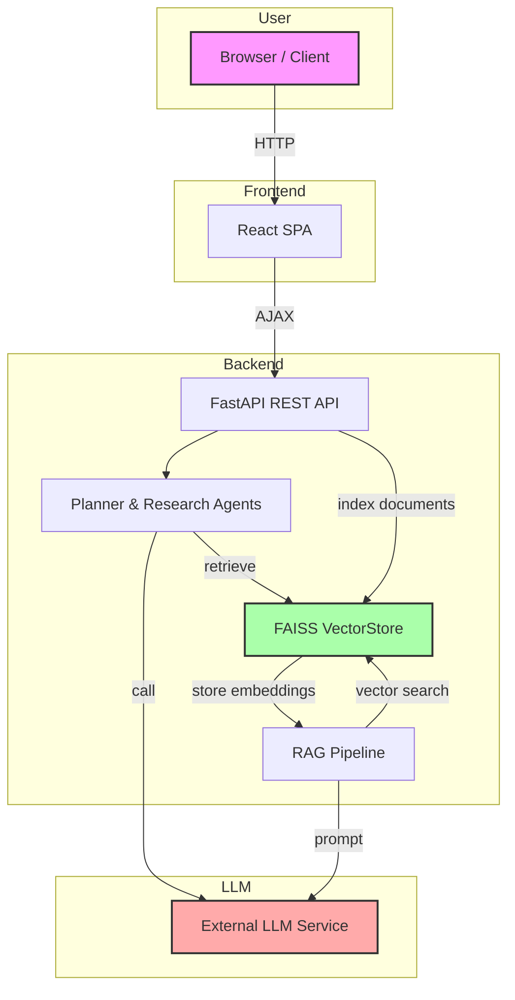

# Technical Architecture — Enterprise NotebookLM

This document describes the high-level system architecture, components, and data flow.

## Components

- **Frontend (React):** A single-page application that provides a chat interface and document upload UI. Communicates with backend via REST API.
- **Backend (FastAPI):** Serves API endpoints, orchestrates agents, calls LLMs, and manages a FAISS vector store.
- **Vector Store (FAISS):** Holds embedded representations of ingested documents for retrieval.
- **LLM Provider:** External large language model API used by agents for planning, summarization, and answering queries.

## Data Flow

### Explanation

1. **User Interaction:** Users interact via the React interface which sends API requests to the backend.
2. **Backend Routing:** FastAPI routes requests to appropriate controllers in `backend/app/api`.
3. **Agents & RAG:** On chat/research requests, the backend may invoke agents (`planner_agent`, `research_agent`) that orchestrate retrieval-augmented generation (RAG).
4. **Vector Store:** Documents are parsed and embedded, then stored in FAISS. Retrieval queries the vector store to find relevant passages.
5. **LLM Calls:** The backend sends prompts to an external LLM service (e.g., OpenAI, Anthropic) for generating text or planning the next steps.
6. **Response Assembly:** Results from the LLM and retrieval are assembled and returned to the frontend.

## Deployment Considerations

- Use environment variables to configure API keys, model endpoints, and database paths.
- Secure communication with HTTPS and proper authentication for production.

## Scaling

- Host the vector store on a dedicated service or use cloud-based vector DBs for large-scale documents.
- Run the backend and frontend in containers with orchestration (Docker/Kubernetes).

